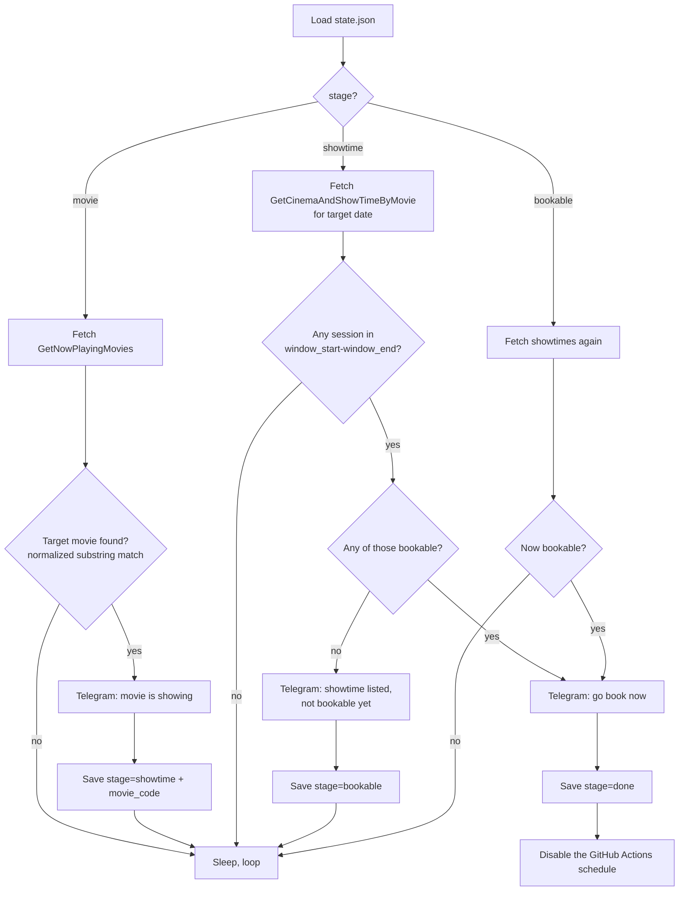

# Carnival Cinemas Now-Showing Watcher

Watches [carnivalcinemas.sg](https://carnivalcinemas.sg/#/) for a specific movie
to appear in the Now Showing list, then watches for a showtime in a specific
time window on a specific date, and sends a Telegram alert at each milestone —
so you find out the moment tickets for the show you actually want can be
booked, instead of refreshing the site by hand.

Built for a real case: Tamil movie releases on this site tend to sell out
within minutes of going live, and showtimes for a given date are sometimes
posted in batches (e.g. a 1:30 PM show appears before the 7:00 PM one you
actually want).

## Why this works without a browser

The site is an AngularJS single-page app. Its "Now Showing" grid and its
per-movie "Book Your Tickets" page aren't rendered server-side — the Angular
app calls a JSON API (`service.carnivalcinemas.sg`) and renders the response
client-side. That API is protected by a `Token` header, computed in the
browser from a secret string (`rz8LuOtFBXphj9WQfvFh`) baked into the site's
own public JS bundle (`cinemaManager.generate` in `AllJavaScripts`).

Because that secret is shipped to every visitor's browser, the HMAC-SHA256
signing scheme is fully reproducible outside a browser. `watch_now_showing.py`
re-implements it in ~10 lines of stdlib Python (see `_generate_token`), so the
script talks to the same API the site itself uses — no Selenium, no
Playwright, no HTML scraping, no headless browser. Just `urllib` and `hmac`.

## The two APIs this project calls

| Purpose | Endpoint |
|---|---|
| Now Showing list for a city | `GET /api/QuickSearch/GetNowPlayingMovies?location=Singapore` |
| Showtimes for a movie on a date | `GET /api/QuickSearch/GetCinemaAndShowTimeByMovie?location=Singapore&movieCode=...&date=...` |

Querying a date that hasn't been scheduled yet just returns an empty list
(HTTP 200, no sessions) — it doesn't error. That's what makes polling safe:
the script can ask "any showtimes yet?" every cycle and get a clean answer
either way.

## Technical flow

Each poll cycle is one pass through this diagram, then a
`POLL_INTERVAL_SECONDS` sleep before the next pass, for up to
`MAX_RUNTIME_SECONDS` per run.

## The four stages, persisted in `state.json`

1. **`movie`** — waiting for the target movie to show up in Now Showing at all.
2. **`showtime`** — movie is showing; waiting for any showtime inside the
   target time window to appear on the target date, in any state (listed or
   bookable). Alerts once either way, so you're not blindsided if a listed
   showtime turns out to be a non-target time.
3. **`bookable`** — a matching showtime is listed but flagged not-bookable
   yet (the site marks each session bookable/not with a trailing flag on the
   showtime string); waiting for it to flip.
4. **`done`** — a matching, bookable showtime was found and alerted. The
   script calls the GitHub API to disable its own workflow schedule here, so
   it stops running instead of alerting repeatedly.

State is written to `state.json` and committed back to the repo after every
run (see the "Persist state" step in the workflow) — that's what lets a
5-hour-later restart resume from where it left off instead of re-alerting
from scratch.

## Why polling restarts every 5 hours instead of running continuously

A single GitHub Actions job can run for at most a few hours before GitHub
kills it. So instead of one long-lived process, the workflow:

- Triggers on a cron schedule every 5 hours (`0 */5 * * *`).
- Each run polls internally every `POLL_INTERVAL_SECONDS` (default 90s) in a
  loop, capped at `MAX_RUNTIME_SECONDS` (default 4h50m — deliberately a bit
  short of the 5-hour gap, so runs don't overlap).
- Progress (`state.json`) carries over between runs, so the 90-second polling
  cadence is effectively continuous across the whole watch window, just
  implemented as a series of runs rather than one process.

## Files

| File | Purpose |
|---|---|
| `watch_now_showing.py` | Everything: token auth, API calls, matching logic, Telegram alerts, state machine, self-disable. Stdlib only, no dependencies. |
| `.github/workflows/watch.yml` | Schedules the script every 5 hours, wires up secrets/config as env vars, commits `state.json` back after each run. |
| `state.json` | Current progress (created automatically on first run). Delete it to reset back to stage `movie`. |
| `SETUP.md` | One-time setup: Telegram bot, GitHub secrets, permissions, test run. |

## Configuration

All set via env vars in `.github/workflows/watch.yml`:

| Variable | Meaning | Default |
|---|---|---|
| `TARGET_MOVIE` | Movie name to watch for. Matching is case/space-insensitive substring, so `"Jana Nayagan"` matches `"JANANAYAGAN (TAMIL)"`. | `Jananayagan` |
| `TARGET_DATE_VALUE` | The show date to watch, in the API's own format (`YYYY-MM-DDT00:00:00`). | `2026-07-23T00:00:00` |
| `WINDOW_START` / `WINDOW_END` | Time-of-day range (24h `HH:MM`) a showtime must fall in to trigger an alert. | `18:30` / `20:00` |
| `LOCATION` | City name as the API expects it. | `Singapore` |
| `POLL_INTERVAL_SECONDS` | Seconds between polls within a run. | `90` |
| `MAX_RUNTIME_SECONDS` | Max seconds a single run polls before yielding to the next scheduled run. | `17400` (4h50m) |

Secrets (set via repo Settings → Secrets, never committed):
`TELEGRAM_BOT_TOKEN`, `TELEGRAM_CHAT_ID`.

## Setup

See [`SETUP.md`](SETUP.md) for the one-time steps: creating the Telegram bot,
getting your chat ID, adding repo secrets, enabling write permissions for the
workflow token, and doing a safe test run against a movie that's already
showing.
